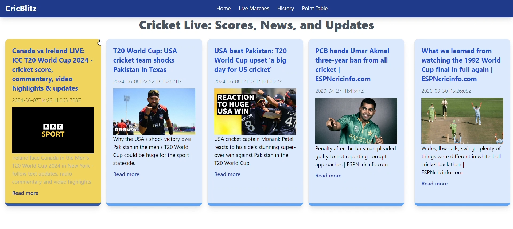
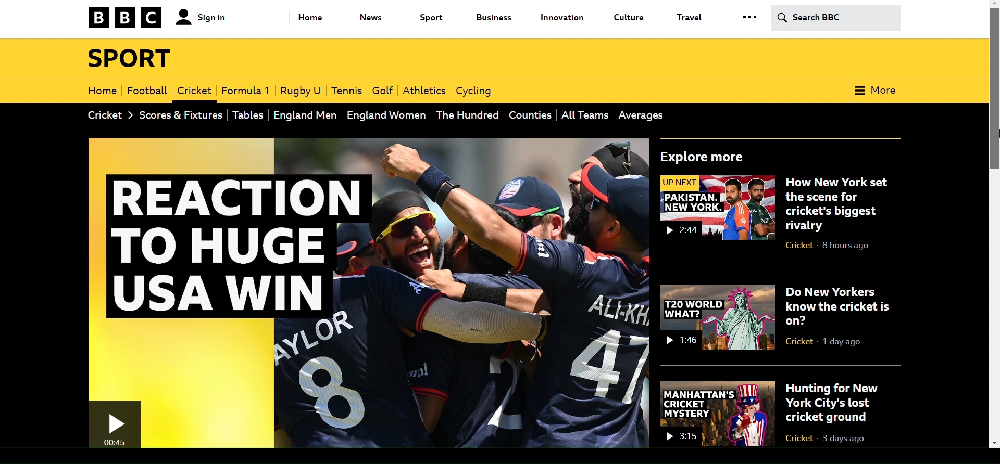
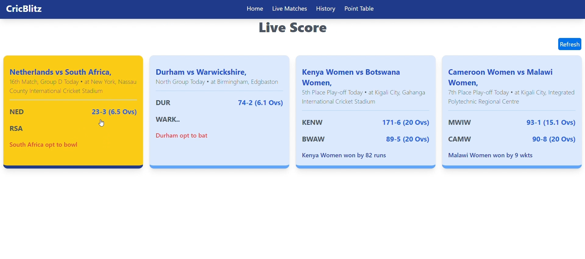
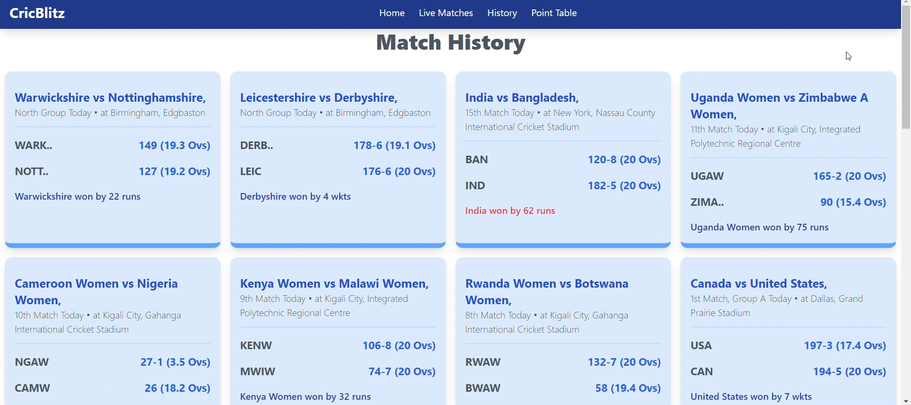
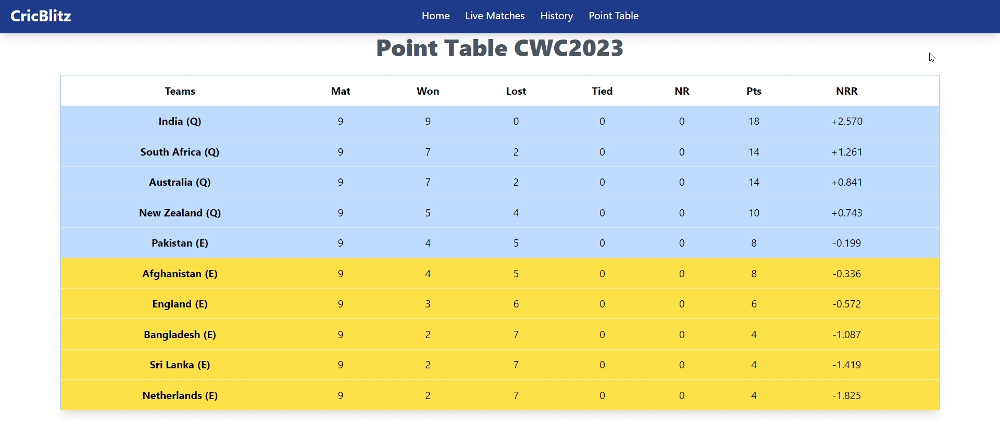

# CricBlitz

**CricBlitz** is a dynamic cricket platform designed to provide real-time news, live scores, match histories, and points tables. Built using **React** and **Spring Boot**, CricBlitz delivers up-to-date cricket insights, news, and live match information, making it a must-have platform for all cricket enthusiasts.

## Features

### 1. **Real-Time Cricket News**
   - Fetches the latest cricket news using an integrated **News API**.
   - Automatically updates with the latest headlines.

### 2. **Live Scores & Match Data**
   - Provides live scores for ongoing cricket matches.
   - Live data scraping ensures up-to-date match information from reliable sources.
   - Scores are primarily focused on **CWC (Cricket World Cup)**, giving users access to live CWC match updates.

### 3. **Comprehensive Match History**
   - Access detailed match histories, including scores.
   - Match history displays key information such as:
     - Team names and scores
     - Winning team and margin of victory (e.g., won by X runs)
     - Day of the match, match number, and location
   - Historical match data is stored and updated regularly for user insights.

### 4. **Points Table**
   - Displays the latest points tables for ongoing cricket tournaments.
   - Provides an overview of team rankings, points earned, net run rate and standings in the tournament.
   - Points table is dynamically updated with current tournament standings.

### 5. **User-Friendly UI**
   - Built with **React**, providing a smooth, responsive, and intuitive interface for users.
   - Optimized for seamless navigation and real-time updates.

## Tech Stack

### **Backend:**
- **Spring Boot**: Used for building the RESTful backend API.
- **Jsoup**: Integrated for web scraping to fetch live match data, points tables, and match history.
- **MySQL**: Database used for storing match data, deployed on **Railway.app**.

### **Frontend:**
- **React**: Used for building the frontend, ensuring an interactive user experience.
- **Vercel**: The frontend is deployed on **Vercel** for rapid and efficient content delivery.

### **Other Integrations:**
- **News API**: Used to fetch the latest cricket news.

## Screenshots

Below are screenshots showcasing the app's UI and functionalities:

### 1. **Latest News**
   
   
   
  - Provides the latest updates on cricket, including match highlights, player news, and team announcements.

### 2. **Live Scores Dashboard**
   
   - Displays real-time scores and updates for ongoing cricket matches.

### 3. **Match History Overview**
   
   - Showcases detailed match information, including team scores, match number, date, location, and results.

### 4. **Points Table (CWC)**
   
   - Presents the current standings and rankings for the Cricket World Cup.

## Deployment

### Backend:
The backend of CricBlitz is built with **Spring Boot** and deployed on **Railway.app**. It handles data scraping, database interactions, and API serving.

### Frontend:
The frontend, built with **React**, is deployed on **Vercel**. It connects seamlessly with the backend, offering real-time data display to the users.

## Visit CricBlitz

Explore real-time cricket news, live scores, and more by visiting our platform: [CricBlitz](https://cricblitz.vercel.app).

## Frontend Repository

For the frontend code, visit: [CricBlitz Frontend Repository](https://github.com/samFusedBits/cricblitz).
